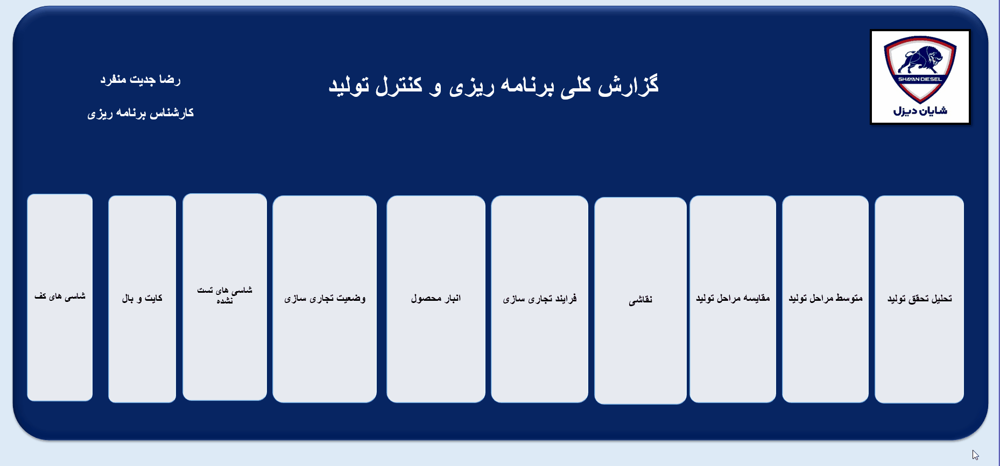

# 🏭 Production Planning & Control Operations Hub

## 📌 Executive Summary
The **Production Planning & Control (PPC) Operations Hub** is an advanced operational intelligence system built for Shayan Diesel. This dashboard acts as the central nerve center for the manufacturing cycle, providing end-to-end visibility from production stages and chassis assembly to finished goods inventory and commercialization.

By consolidating operational data into a singular, navigation-driven interface, this tool empowers management to optimize throughput, reduce lead times, and make data-driven decisions regarding inventory and production capacity.

---

## 🎥 Dashboard Overview
The dashboard utilizes a modular "Hub-and-Spoke" architecture, allowing users to drill down into specialized functional areas with a single click.

### 🎨 Design Philosophy:
- **Centralized Navigation:** Designed for rapid access, minimizing the time required to switch between disparate production and commercial datasets.
- **Unified Interface:** Provides a consistent look and feel across all 10 specialized operational modules, ensuring high user adoption and intuitive navigation for factory personnel.

---

## 📊 Operational Modules Breakdown

The dashboard is structured into four core functional pillars:

### 1. Production Performance & Analytics
*   **Production Achievement Analysis:** Tracks actual output against production targets.
*   **Production Stages Comparison:** Benchmarks the efficiency of different stages in the manufacturing lifecycle.
*   **Production Stages Average:** Monitors average cycle time per stage to identify bottlenecks in the line.

### 2. Manufacturing & Assembly
*   **Chassis Floor:** Tracks the foundation phase of the assembly line.
*   **Kit & Cab Assembly:** Manages the integration of structural and aesthetic components.
*   **Painting:** Monitors the throughput and quality compliance of the painting process.

### 3. Quality & Compliance
*   **Untested Chassis Status:** A critical QC module that flags units pending testing, ensuring no product moves to the next stage without meeting safety standards.

### 4. Commercial & Inventory Management
*   **Finished Goods Inventory:** Real-time visibility into stock levels to prevent overproduction or fulfillment gaps.
*   **Commercialization Process:** Tracks the workflow of moving goods from manufacturing to the market.
*   **Commercial Status:** Monitors the overall market readiness and sales status of current inventory.

---

## 🛠️ Technical Stack & Implementation

- **Data Architecture:** A highly normalized relational database structure using **Power Pivot**, linking production logs, inventory records, and commercial status sheets into a unified data model.
- **Advanced Dynamic Reporting:** The interface leverages **VBA-free navigation** and interactive object linking to provide a seamless app-like experience within the Excel workbook.
- **Scalability:** Built using **dynamic array functions** (`FILTER`, `XLOOKUP`, `INDEX/MATCH`), ensuring the dashboard automatically updates its visuals as new production data is ingested from the floor.
- **Data Integrity:** Implements robust error-checking logic to ensure data consistency across the assembly, inventory, and QC departments.

---

## 📈 Strategic Business Value
1. **Bottleneck Identification:** By comparing production stage averages, management can pinpoint exactly where delays occur, reducing "work-in-progress" (WIP) time.
2. **Quality Assurance:** The inclusion of an "Untested Chassis" module ensures proactive quality management, preventing defective or unverified units from reaching the shipping stage.
3. **Optimized Inventory:** The link between finished goods and commercial status enables better coordination between the production floor and the sales department, leading to improved cash flow and inventory turnover.

---

