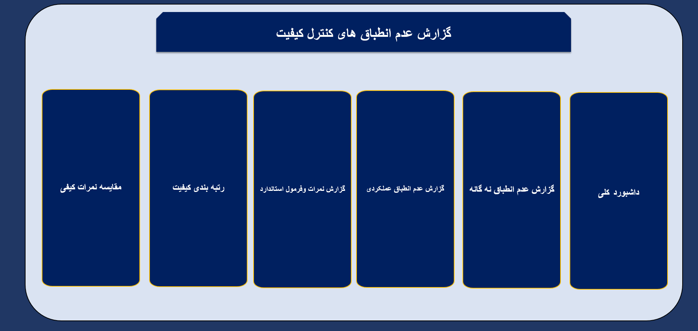

# 🛡️ Quality Control & Non-Conformity Analytics Dashboard

## 📌 Executive Summary
The **Quality Control (QC) & Non-Conformity Report Dashboard** is a robust Business Intelligence solution developed to drive manufacturing excellence. It provides a structured methodology for identifying, tracking, and analyzing defects across production lines.

By implementing a sophisticated "Non-Conformity" classification system, this dashboard enables QA teams to shift from reactive inspection to predictive quality management, ensuring adherence to rigorous international or internal standards.

---

## 🎥 Dashboard Overview
The dashboard features an intuitive, navigation-driven interface that serves as a central control panel for all quality-related reporting.

### 🎨 Key Architectural Features:
- **Centralized Quality Hub:** A clean navigation system that allows QC managers to quickly pivot between high-level management overviews and granular, detailed defect reports.
- **Standardization:** Designed to strictly enforce and monitor adherence to specific Quality KPIs and scoring formulas.

---

## 📊 Analytical Module Breakdown

### 1. Master Quality Dashboard
*   **Purpose:** The "Single Source of Truth." Provides a high-level visual summary of the overall quality health, including current pass/fail rates and critical violation alerts.

### 2. Nine-Category Non-Conformity Analysis
*   **Purpose:** Employs a multi-point defect classification framework.
*   **Analytical Depth:** Breaks down systemic failures into nine distinct categories. This allows the QA team to pinpoint the root causes of systemic errors, rather than treating issues as isolated incidents.

### 3. Operational Non-Conformity Report
*   **Purpose:** Focuses on process-based compliance.
*   **Analytical Depth:** Tracks deviations from standard operating procedures (SOPs) during the production lifecycle, identifying where the process flow fails to meet operational standards.

### 4. Compliance Standards & Scoring Methodology
*   **Purpose:** The technical backbone of the system.
*   **Analytical Depth:** Defines and reports on the formulas used for scoring quality. This ensures that every stakeholder understands *how* the quality score is calculated, promoting transparency and trust in the metrics.

### 5. Quality Ranking (Benchmarking)
*   **Purpose:** Performance comparison across different production lines or shifts.
*   **Analytical Depth:** Ranks different units based on their non-conformity frequency, allowing management to apply resources where they are needed most.

### 6. Quality Score Benchmarking
*   **Purpose:** Comparative analysis.
*   **Analytical Depth:** Allows for "Apples-to-Apples" comparison of quality scores over different time periods or production batches.

---

## 🛠️ Technical Stack & Implementation

- **Data Modeling:** Built on a relational **Power Pivot** architecture that links defect logs to standard compliance databases.
- **Advanced Calculation Engine:** Uses complex DAX measures to calculate "Quality Scores" based on weighted non-conformity factors.
- **Dynamic Reporting:** Utilizes `FILTER` and `XLOOKUP` functions to generate real-time reports based on selected defect categories or timeframes.
- **Interactive UI:** The navigation is built using dynamic shape-linking, ensuring a frictionless user experience without the need for complex VBA macros.

---

## 📈 Strategic Business Value
1. **Compliance Adherence:** Provides an immutable record of quality compliance, essential for internal audits and maintaining certifications (e.g., ISO standards).
2. **Root Cause Identification:** The "Nine-Category" analysis forces the organization to categorize defects systematically, making it easier to implement corrective and preventive actions (CAPA).
3. **Data-Driven Quality Culture:** By visualizing rankings and scores, the dashboard promotes healthy competition among production teams to improve their quality output.

---

