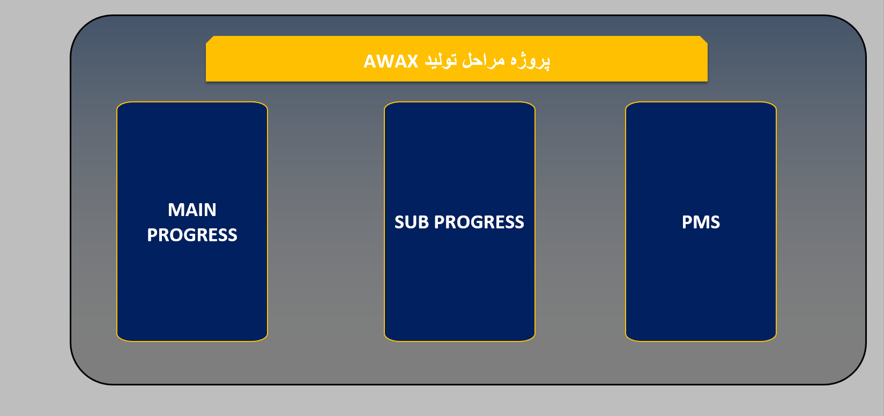

# AWAX Production Stages Dashboard

## 📌 Executive Summary
The **AWAX Production Stages** project is a comprehensive Business Intelligence dashboard designed to monitor and manage end-to-end production processes. Developed using advanced features in Microsoft Excel, this tool eliminates manual reporting by centralizing key performance indicators (KPIs) into a dynamic, interactive interface. It empowers management and operational teams to track performance across three core pillars: Main Progress, Sub Progress, and the Project Management System (PMS).

---

## 🎥 Dashboard Preview
The modular interface ensures seamless navigation between different project levels:

---

## 🏗️ Analytical & Operational Modules

### 1. MAIN PROGRESS
This module provides a high-level overview of the entire production lifecycle.
*   **Functionality:** Tracks major project milestones against planned timelines.
*   **Strategic Value:** Offers a 360-degree view for stakeholders to monitor the overall health of the production initiative.

### 2. SUB PROGRESS
A focused module for granular operational tracking.
*   **Functionality:** Manages specific execution phases, quality control points, and identifies potential bottlenecks.
*   **Strategic Value:** Enables precise identification of operational delays or deviations from quality standards.

### 3. PMS (Project Management System)
The central engine for resource and schedule management.
*   **Functionality:** Coordinates human resources, raw materials, and cross-departmental synchronization.
*   **Strategic Value:** Ensures alignment across all production sections to prevent scheduling conflicts and maintain operational flow.

---

## 🛠️ Technical Stack & Implementation
This dashboard is engineered using professional data modeling standards:

*   **Data Modeling:** Relational data architecture connecting production stages with operational databases.
*   **Interactive Controls:** Advanced form controls for dynamic data filtering and chart updates without manual input.
*   **Advanced Logic:** Implementation of automated calculations for progress tracking, variance analysis, and performance metrics.

---

## 📈 Strategic Value
1. **Operational Transparency:** Translates complex production data into intuitive visual insights for all organizational levels.
2. **Error Reduction:** Automation of progress calculations significantly reduces the risk of manual data entry errors.
3. **Agile Decision Making:** Instant visibility into "Main" and "Sub" modules allows for rapid corrective actions, preventing production downtime.

---

