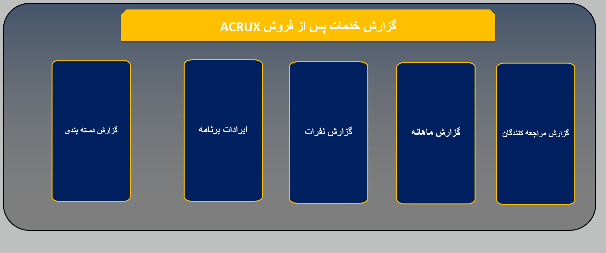

# 🛠️ ACRUX After-Sales & Customer Support Performance Dashboard

## 📌 Executive Summary
The **ACRUX After-Sales Intelligence Dashboard** is an enterprise-grade Business Intelligence (BI) solution built entirely within Microsoft Excel. Designed to provide 360-degree visibility into post-sales operations, this tool enables management to transition from reactive troubleshooting to proactive data-driven decision-making. 

By centralizing data on client behavior, defect categorization, software performance, and temporal trends, this dashboard serves as the single source of truth for the service department’s operational performance.

---

## 🎥 Dashboard Overview
The dashboard features an interactive **Main Menu Interface (Navigation Hub)** that allows decision-makers to seamlessly drill down into five specialized analytical modules.

### 🎨 UI/UX Highlights:
- **Interactive Navigation Hub:** Custom menu cards acting as clickable gateways to specific reporting modules.
- **Unified Visual Language:** Professional dark-slate backdrop with a high-contrast Gold & Blue color palette for clear data storytelling.
- **Dynamic Filtering:** Integrated timeline controls and slicers allow for real-time data segmentation by date range, client, and personnel.

---

## 📊 Analytical Module Breakdown

### 1. Visitor & Client Analytics
*Focus: CRM and Loyalty Tracking*
- **Operational Metrics:** Tracks **58 total visits** with a rolling **monthly average of 5.3 visits**. 
- **Analytical Depth:** Provides granular visibility into client behavior, including visit frequency (Minimum: 1, Maximum: 12).
- **Key Insight:** Features a "Top Clients" leaderboard identifying high-retention accounts. For example, specific clients like *Mohammadreza Baran* were identified as contributing to **19%** of total service visits.

### 2. Defect Proportionality Matrix
*Focus: Resource Allocation*
- **Operational Metrics:** Maps the total service burden across different technical domains.
- **Key Insight:** **Software & Programming issues (39.81%)** and **Mechanical defects (25.16%)** are the primary drivers of service center volume. Electrical and Service maintenance categories account for roughly 13% each.
- **Business Application:** Enables management to optimize resource allocation by prioritizing training for the most frequent issue categories.

### 3. Software & Application Defect Analysis (Pareto Deep-Dive)
*Focus: Engineering Quality Assurance*
- **Operational Metrics:** Analyzes bug resolution cycles and defect distribution.
- **Key Insight:** Leveraging Pareto Analysis, the dashboard highlights that **four primary technical items (ECAS-1, Radar Calibration, Cabin Adjustment, and Generic Bug Types)** represent nearly **70% of all software-related defects**.
- **Business Application:** Provides a direct roadmap for R&D/Engineering teams to patch the most critical systemic bugs, reducing overall ticket inflow.

### 4. Personnel & Team Performance
*Focus: Human Resource Optimization*
- **Operational Metrics:** Tracks individual technician workload, resolution velocity, and throughput.
- **Analytical Depth:** Compares "Open" vs. "Resolved" cases, enabling team leads to identify bottlenecks in the resolution pipeline and rebalance technician shifts accordingly.

### 5. Monthly Service Trends
*Focus: Capacity Planning*
- **Operational Metrics:** Visualizes seasonal ticket inflow and growth trends for the year 1404.
- **Business Application:** Assists in forecasting peak service demand periods, ensuring adequate technician availability during high-traffic months.

---

## 🛠️ Technical Stack & Implementation

- **Data Modeling:** Orchestrated using an **Extract, Transform, Load (ETL)** workflow via Power Query to clean and normalize raw service logs.
- **Data Architecture:** Developed a relational **Power Pivot Data Model**, utilizing star-schema relationships between fact tables (tickets/visits) and dimension tables (clients, categories, dates).
- **Advanced Calculations:** Heavy utilization of dynamic array functions (`FILTER`, `UNIQUE`, `XLOOKUP`, `INDEX/MATCH`) for real-time reporting without the need for manual updates.
- **UI/UX Design:** Implemented dynamic shape-linking for frictionless, VBA-free cross-module navigation.
- **Conditional Formatting:** Automated color-coded KPI alerts for overdue tickets, low-performance scores, and critical defect thresholds.

---

## 💡 Strategic Business Value
1. **Resource Optimization:** Balanced technician shifts based on seasonal ticket inflow trends identified in the Monthly Trend module.
2. **Product Quality Feedback:** Pinpointed critical software bugs, providing engineering teams with actionable data to patch recurring errors.
3. **Improved Client Retention:** Utilized visitor tracking to identify high-value clients and intervene proactively.

---

