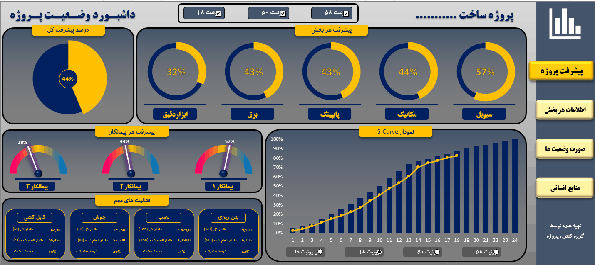

# 🏗️ Oil & Gas Project Management & Status Dashboard

## 📌 Executive Summary
The **Oil & Gas Project Management Dashboard** is a comprehensive Business Intelligence solution designed for large-scale construction and infrastructure projects. It facilitates real-time tracking of physical progress, monitoring of discipline-wise milestones, and vendor performance benchmarking.

By integrating disparate data points—ranging from concrete pouring volumes to complex mechanical installation—this dashboard enables Project Managers and PMO teams to maintain total visibility over schedule adherence and resource allocation.

---

## 🎥 Dashboard Preview
The dashboard utilizes an integrated control panel to switch between project units, ensuring focused reporting for specific site areas.

---

## 📊 Core Analytical Modules

### 1. Global Progress Metrics
*   **Total Project Progress:** Provides a high-level "pulse" of the project (e.g., 44% overall completion), serving as the primary KPI for stakeholders.
*   **Segment/Discipline Breakdown:** Monitors progress across core engineering disciplines: **Civil (57%)**, **Mechanical (44%)**, **Piping (43%)**, **Electrical (43%)**, and **Instrumentation (32%)**. This view identifies critical bottlenecks where specific trades may be lagging behind schedule.

### 2. S-Curve Performance Tracking
*   **Analysis:** The S-Curve is the industry standard for monitoring project health. By visualizing actual progress versus the planned baseline over a 24-month timeline, the dashboard highlights potential schedule variance before it becomes critical.
*   **Value:** Allows management to forecast completion dates and adjust resources proactively.

### 3. Vendor & Contractor Benchmarking
*   **Analysis:** Employs radial gauge charts to visualize the performance of multiple contractors.
*   **Value:** Essential for vendor management; it allows for the immediate identification of high-performing partners versus those requiring intervention or corrective action.

### 4. Operational Activity Tracking (Quantity-Based Progress)
*   **Analysis:** Moving beyond mere percentages, this module tracks tangible work volumes. 
*   **Metrics:** Real-time monitoring of:
    *   **Concrete Pouring (m3):** Tracking planned vs. actual volume.
    *   **Installation (Ton):** Monitoring heavy-lifting milestones.
    *   **Welding (ID) & Cabling (M):** Tracking technical installation progress critical to the electrical and piping disciplines.
*   **Value:** Provides quantitative data for progress reporting (Progress Measurement System), ensuring billing and milestone payments are backed by physical evidence.

---

## 🛠️ Technical Implementation Details

- **Dynamic Data Filtering:** The dashboard features unit-level toggling (Units 18, 50, 58), allowing users to filter the entire view by physical site location.
- **Advanced Data Modeling:** Developed using a relational **Power Pivot Data Model** that connects disparate activity logs (Cabling, Welding, Installation) to the project master schedule.
- **Visual Engineering:** 
    - **S-Curve Generation:** Uses dynamic plotting to map cumulative progress.
    - **Dynamic Gauges:** Custom-built chart elements that provide intuitive visual feedback on performance percentages.
- **Navigation Architecture:** A streamlined sidebar provides quick access to supporting reports, including Resource Management and Cost/Status reporting.

---

## 📈 Strategic Business Value
1. **Schedule Control:** By comparing S-Curve baseline vs. actual, the project team can detect and mitigate delays in real-time.
2. **Discipline Alignment:** Ensures that downstream tasks (e.g., mechanical installation) are not held up by upstream dependencies (e.g., civil concrete pouring).
3. **Evidence-Based Reporting:** Transforms raw site logs into executive-ready dashboards, reducing the time spent on manual progress reporting.

---
