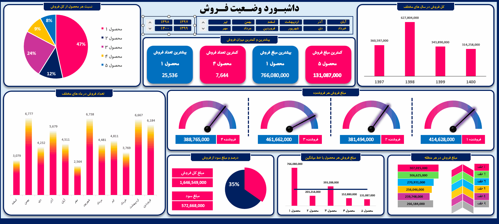

# Sales Analytics Dashboard

This repository contains the documentation and implementation of the **Sales Analytics Dashboard**, a comprehensive tool designed for visualizing, monitoring, and analyzing key sales performance metrics. It provides actionable insights into sales trends, product performance, revenue generation, and regional distribution.

## 🖼️ Dashboard Preview

---

## 📊 Dashboard Overview

The dashboard is structured to provide stakeholders with a 360-degree view of organizational performance. It leverages historical data to facilitate data-driven decision-making, performance tracking, and strategic planning.

### 1. Filters & Global Controls
*   **Fiscal Period Filter:** Users can filter data by specific years (1397–1400) and months to isolate performance trends during particular seasons or fiscal cycles.

### 2. Summary KPI Cards
This section provides an immediate snapshot of the company's vital statistics:
*   **Highest Sales Volume:** Identifies the top-performing product by unit count.
*   **Lowest Sales Volume:** Highlights products that may require marketing intervention.
*   **Highest Revenue:** Displays the product generating the most income.
*   **Lowest Revenue:** Displays the product with the minimum financial contribution.

### 3. Product Analysis (Commercialization & Share)
*   **Product Market Share (Pie Chart):** Visualizes the percentage distribution of each product's contribution to total sales, highlighting which products dominate the portfolio (e.g., Product 1 holds a 47% share).
*   **Revenue per Product (Bar Chart):** Compares the financial performance of each product against the company average. This allows for the identification of "star" products versus underperformers relative to the mean.

### 4. Sales Trends & Historical Performance
*   **Annual Sales Trends:** A bar chart comparing total sales revenue across the years 1397, 1398, 1399, and 1400.
*   **Monthly Sales Volume:** A bar chart tracking the number of units sold per month, identifying seasonal peaks (such as end-of-year spikes in Esfand).

### 5. Sales Team Performance
*   **Gauge Charts:** Tracks the individual revenue generated by four distinct sales representatives. These gauges visually demonstrate how each representative is performing relative to company targets.

### 6. Profitability & Financial Summary
*   **Total Revenue:** The aggregate sales amount.
*   **Total Profit:** The net profit realized.
*   **Profit Margin:** A donut chart showing the overall profit percentage (currently at 35%), providing a high-level view of financial health.

### 7. Regional Sales Distribution
*   **Regional Breakdown:** A visual breakdown of sales performance across different geographic zones (Zones 1 through 6). This section is critical for assessing market penetration and regional demand.

---

## 📈 Key Insights

*   **Dominant Product:** Product 1 serves as the primary revenue driver, contributing nearly half (47%) of all sales.
*   **Seasonal Volatility:** The sales volume shows significant fluctuation, with peaks in specific months (e.g., Esfand, Shahrivar, and Ordibehesht), suggesting seasonal demand patterns.
*   **Financial Health:** The 35% profit margin indicates healthy cost management and effective pricing strategies.
*   **Team Competition:** The sales representatives show varied performance levels, which can be used to set individual benchmarks and incentive programs.

---

## 🛠️ Implementation Details

*   **Data Sources:** The dashboard consumes data from historical sales logs and CRM databases.
*   **Visualization Logic:** Designed using [Insert Tool Name, e.g., Power BI / Excel], employing dynamic filtering to ensure real-time updates.
*   **Target Audience:** Sales Managers, Financial Controllers, and Executive Leadership.

---

## 🚀 How to Use
1.  **Clone the repository:** `git clone [repository-url]`
2.  **Open the dashboard file:** Load the source file into your analytics environment.
3.  **Interact with filters:** Select the desired Year and Month from the top-left menu to refresh all visualizations automatically.

