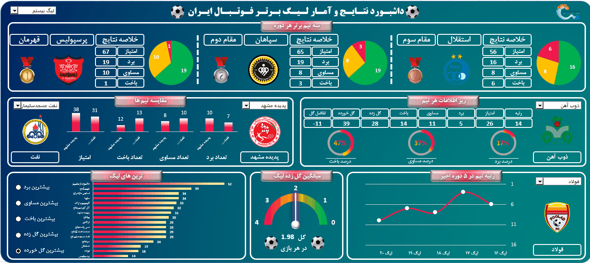

# ⚽ Iran Pro League Performance Analytics Dashboard

## 📌 Executive Summary
The **Iran Pro League Analytics Dashboard** is a high-performance Business Intelligence (BI) tool developed in Microsoft Excel. It transforms raw seasonal football data into actionable insights, allowing users to benchmark team performance, track historical trends, and perform comparative analysis across the league.

This dashboard serves as a comprehensive reporting interface, enabling stakeholders to move beyond static data and interact with key performance indicators (KPIs) through dynamic filtering and visual analytics.

---

## 🎥 Dashboard Preview
The interface is designed with a high-contrast theme and a modular layout, ensuring that complex data sets are easily consumable.

---

## 📊 Analytical Modules

### 1. Podium Performance (Top 3 Teams)
This section offers a high-level snapshot of the season’s top three finishers. 
*   **Metrics:** Displays total points, win/draw/loss counts, and a win-rate distribution via interactive pie charts for each top-tier club.
*   **Value:** Provides an immediate visual representation of dominance and point-gap analysis at the top of the table.

### 2. Team Comparison Engine
A dedicated module for "Head-to-Head" analysis between any two teams selected via dropdown slicers.
*   **Metrics:** Side-by-side comparison of total points, wins, draws, losses, and goal-difference statistics.
*   **Visuals:** Utilizes grouped bar charts to immediately highlight performance disparities between selected clubs (e.g., Naft Masjed Soleyman vs. Padideh Mashhad).

### 3. Detailed Team Deep-Dive
Selecting a specific team triggers a granular report featuring:
*   **Statistical Breakdown:** Ranking, total points, goals scored vs. conceded, and win/loss percentages.
*   **Visuals:** Gauge and donut charts provide an instant health-check on a team's offensive and defensive efficiency.

### 4. League Leaders (Rankings & Extremes)
An interactive ranking module powered by radio-button controls.
*   **Functionality:** Allows the user to sort the entire league by multiple criteria: "Most Wins," "Most Draws," "Most Losses," "Highest Goals Scored," and "Highest Goals Conceded."
*   **Visuals:** Horizontal bar charts provide an intuitive ranking of all teams relative to the selected metric.

### 5. Historical & Efficiency Trends
*   **Goal Efficiency:** A central gauge chart displays the league's "Average Goals Per Match" (currently 1.98), providing context on the league’s overall offensive output.
*   **Performance Trend:** A line chart visualization tracking a team’s ranking evolution over the last five seasons, offering insights into long-term organizational trajectory rather than just single-season performance.

---

## 🛠️ Technical Stack & Implementation

This dashboard demonstrates advanced Excel engineering principles:

*   **Data Modeling:** Relational data architecture using **Power Pivot** to manage multiple seasonal datasets, ensuring seamless connectivity between team information and historical league results.
*   **Dynamic Visuals:** Implementation of dynamic chart series using `OFFSET` and `INDIRECT` functions, allowing charts to update automatically based on slicer selection.
*   **Advanced Logic:** 
    *   Extensive use of **DAX Measures** for calculating win percentages, points-per-game, and comparative differentials.
    *   Implementation of **Conditional Formatting** to highlight top performers and underachieving metrics.
*   **Interactive Controls:** Slicers and form controls used to create a frictionless User Interface (UI), removing the need for users to touch the underlying data sheets.

---

## 📈 Strategic Analytical Value
1. **Comparative Benchmarking:** Instantly identifies competitive gaps between teams to inform scouting or strategic planning.
2. **Predictive Trend Insight:** By visualizing five years of ranking data, the dashboard helps stakeholders understand cyclical performance patterns.
3. **Operational Efficiency:** The modular design ensures that complex sports analytics are accessible to non-technical stakeholders through a "click-and-explore" experience.

---

## 👤 Author & Contact
- **Project Developer:** [Your Name]
- **LinkedIn:** [Insert Link]
- **Portfolio Repository:** [Insert Link]

